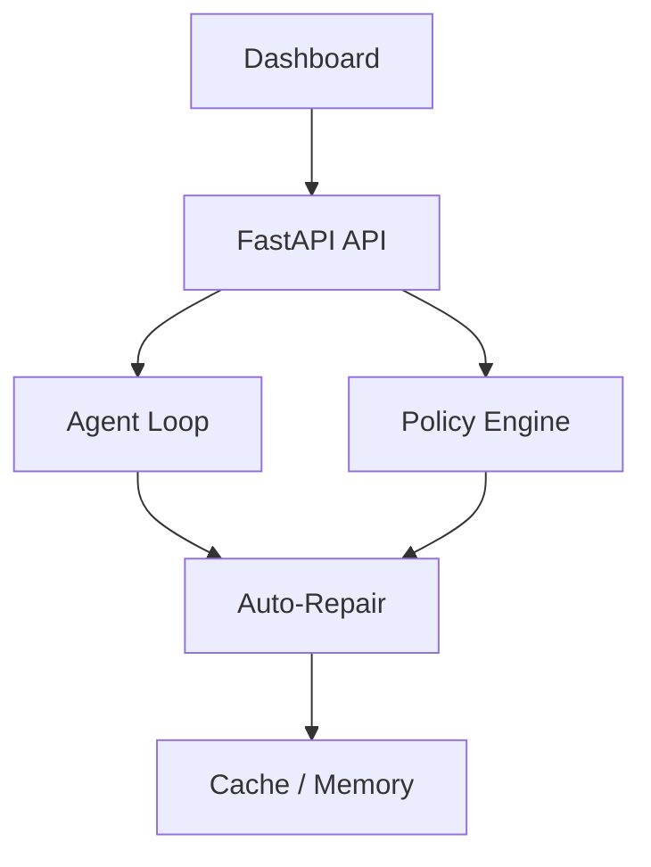

<!-- markdownlint-disable MD012 MD013 MD022 MD032 MD024 MD025-->

# SEGYR Bot 🤖

> Autonomous AI orchestration platform with self-repair, policy-driven decisions, and real-time observability.

---

# 🇬🇧 ENGLISH VERSION

## 🚀 What is SEGYR?

SEGYR is not just an AI agent.

It is a **self-monitoring and self-repairing AI system** capable of:
- Evaluating its own health
- Making decisions via a policy engine
- Executing corrective actions
- Validating impact through a scoring system

---

## 🎯 Core Principles

- Autonomy first
- Self-repair loop
- Observability-driven
- Policy-based decisions
- Resilience by design

---

## 🏗️ System Architecture

```mermaid
flowchart TD

Dashboard --> API[FastAPI API]
API --> Agent[Agent Loop (Skills)]
API --> Policy[Policy Engine]

Agent --> Repair[Auto-Repair]
Policy --> Repair

Repair --> Redis[Redis Cache / Memory]
```

---

## 🧠 Architecture Overview

### 🤖 Agent Layer
- core/agent/loop.py
- segyr_bot/skills/router.py
- segyr_bot/skills/loader.py

### 🧠 Intelligence Layer
- core/monitoring/policy_engine.py

### ⚙️ Execution Layer
- core/monitoring/auto_repair.py

### 🗄️ Data Layer
- Redis cache
- Memory
- Queue system

### 📊 Observability Layer
- /health/full
- /metrics
- logs JSONL

### 🖥️ Interface Layer
- /dashboard
- /dashboard/data
- /dashboard/summary

---

## 🛠️ Installation

```bash
python -m venv .venv
source .venv/bin/activate
pip install -r requirements.txt
```

```bash
cd frontend
npm install
npm run build
```

---

## ▶️ Usage

```bash
uvicorn api.main:app --reload
```

---

# 🇫🇷 VERSION FRANÇAISE

## 🚀 Qu’est-ce que SEGYR ?

SEGYR est un système IA autonome capable de :
- analyser son état
- prendre des décisions
- s’auto-corriger
- mesurer les impacts

---

## 🎯 Principes

- Autonomie
- Auto-réparation
- Observabilité
- Décisions pilotées
- Résilience

---

## 🏗️ Architecture



---

## 🧠 Structure

### Agent
- core/agent/loop.py

### Intelligence
- policy engine

### Execution
- auto repair

### Data
- Redis

### Interface
- dashboard

---

## 🛠️ Installation

```bash
python -m venv .venv
pip install -r requirements.txt
```

---

## ▶️ Utilisation

```bash
uvicorn api.main:app --reload
```

---

## 🧠 Vision

Créer un système IA capable de :
- s’auto-réparer
- prendre des décisions autonomes
- piloter des systèmes complexes
## 🧠 Architecture Overview

