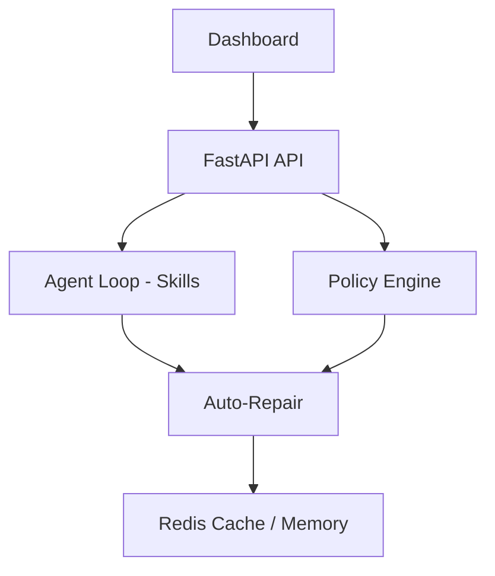
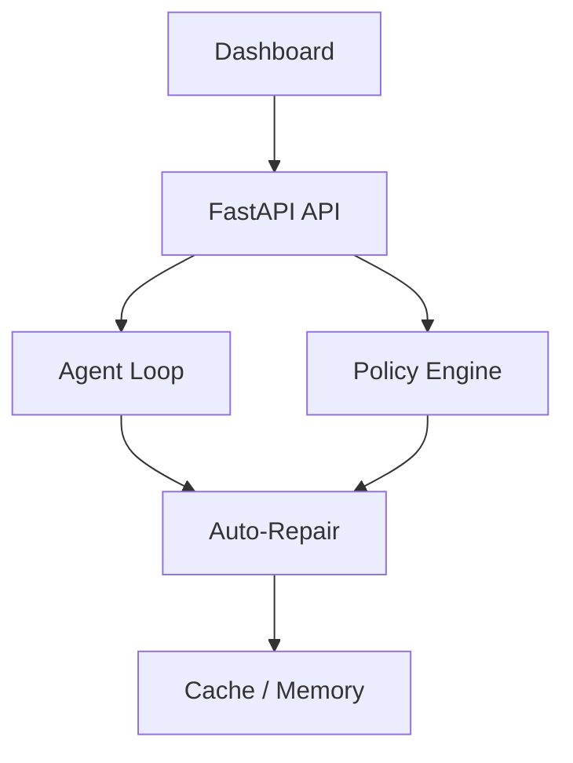

# 🚀 SEGYR Bot

> Autonomous AI orchestration platform with self-repair, policy-driven decisions, and real-time observability.

---

## 🌍 Overview

SEGYR is not just an AI agent.

It is a **self-monitoring, decision-making, and self-repairing system** designed to operate reliably in production environments.

---

## 🎯 Core Capabilities

* 🤖 Autonomous decision-making
* 🔁 Self-repair loop
* 📊 Observability-driven architecture
* ⚖️ Policy-based execution
* 🧠 Memory & context persistence
* ⚡ Real-time API + dashboard

---

## 🏗️ System Architecture



---

## 🧠 Architecture Layers

### 🤖 Agent Layer

* `core/agent/loop.py`
* `segyr_bot/skills/router.py`
* `segyr_bot/skills/loader.py`

### 🧠 Intelligence Layer

* `core/monitoring/policy_engine.py`

### ⚙️ Execution Layer

* `core/monitoring/auto_repair.py`

### 🗄️ Data Layer

* Redis (cache + memory)
* Queue system

### 📊 Observability Layer

* `/health`
* `/health/full`
* `/metrics`
* JSON logs

### 🖥️ Interface Layer

* `/dashboard`
* `/dashboard/data`
* `/dashboard/summary`

---

## 🛠️ Installation (Local)

```bash
git clone https://github.com/S3GYR/segyr-bot.git
cd segyr-bot

python -m venv .venv
source .venv/bin/activate  # Windows: .venv\Scripts\activate

pip install -r requirements.txt
```

---

## 🎨 Frontend

```bash
cd frontend
npm install
npm run build
```

---

## ▶️ Run the API

```bash
uvicorn api.main:app --host 0.0.0.0 --port 8000
```

👉 API available at:

```
http://localhost:8000
```

---

## 🐳 Docker (Production Ready)

### Build locally

```bash
docker build -t segyr-bot .
```

### Run

```bash
docker run -p 8000:8000 segyr-bot
```

---

## 📦 Docker Image (GHCR)

```bash
docker pull ghcr.io/S3GYR/segyr-bot:latest
```

---

## 🔐 Environment Variables

```env
SEGYR_DB_PASSWORD=your_password
SEGYR_JWT_SECRET=your_secret
SEGYR_API_AUTH_TOKEN=your_token

SEGYR_REDIS_URL=redis://localhost:6379/0
SEGYR_LOG_LEVEL=INFO
SEGYR_DEBUG=false
```

---

## 🧪 Testing

```bash
pytest -q
```

---

## ⚙️ CI/CD

* ✅ GitHub Actions (tests + build)
* ✅ Docker image build & push (GHCR)
* ✅ Ready for deployment

---

## 🇫🇷 Version Française

### 🚀 Présentation

SEGYR est une plateforme d’orchestration IA autonome capable de :

* analyser son état
* prendre des décisions
* s’auto-corriger
* mesurer ses performances

---

### 🎯 Fonctionnalités

* Autonomie complète
* Boucle d’auto-réparation
* Observabilité intégrée
* Décisions pilotées par règles
* Mémoire persistante

---

### 🏗️ Architecture



---

### ▶️ Lancement

```bash
uvicorn api.main:app --reload
```

---

## 🧠 Vision

SEGYR vise à devenir :

> Une IA capable de piloter, corriger et optimiser des systèmes complexes de manière autonome.

---

## 📜 License

MIT License

---

## 🤝 Contribution

Pull requests welcome.
For major changes, open an issue first.

---

## 🔥 SEGYR

> “Autonomous systems that think, act, and repair themselves.”
